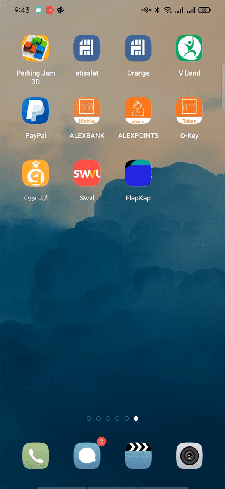
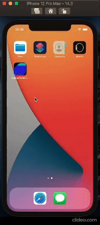
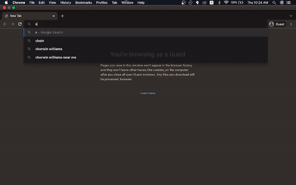

# Quick Challenge [simple responsive visual dashboard for viewing orders statistics]

  
### Running on real android device [as an application & website] & ios Emulator (iphone 12 pro max)

 

  
  <b style="word-space:2em">&nbsp;&nbsp;&nbsp;&nbsp;&nbsp;&nbsp;&nbsp;&nbsp;</b>
  

### Running on desktop [google chrome on a macbook machine]

#### You can test it out through:

 - Downloading android apk from [here][apk]
 
 - visiting the demo website from [here][website]

[apk]: https://drive.google.com/file/d/1-EExxuXaAfYfU_y94nQG68tM8YFogkFr/view?usp=sharing
[website]: https://00ahmedmokhtar00.github.io/quick-challenge/
